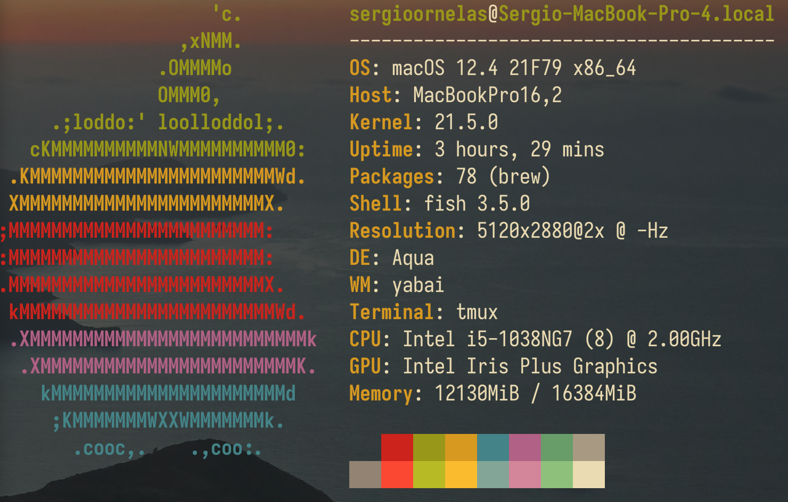

# MacOS dot files

This is my actual dotfiles that I use all day long for all kind of stuff, for working and for personal projects. I've decided to make everything install manually because I don't like to use another software to install my default configuration. All of this configuration is main focused on macOS, but could be adapted for another uses, like linux (but I think nothing of this will makes sense on Windows, sorry). Feel free to explore all my configuration and get what you feel makes sense to you! :^)

## Apps added:

- [karabiner](https://karabiner-elements.pqrs.org/): A powerful and stable keyboard customizer
- [skhd](https://github.com/koekeishiya/skhd): Create keyboard shortcuts
- [yabai](https://github.com/koekeishiya/yabai): Tiling window management for Mac
- [kitty](https://sw.kovidgoyal.net/kitty/): Terminal emulator
- [tmux](https://github.com/tmux/tmux/): Terminal multiplexer (not using it anymore)
- [fish](https://fishshell.com/): The best shell
- [fzf](https://github.com/junegunn/fzf/): Fuzzy search
- [vimiumc](https://chrome.google.com/webstore/detail/vimium-c-all-by-keyboard/hfjbmagddngcpeloejdejnfgbamkjaeg?hl=en): Vim bindings for the browser
- [fd](https://github.com/sharkdp/fd): Better find
- [ripgrep](https://github.com/BurntSushi/ripgrep/): Better grep
- [spacebar](https://github.com/cmacrae/spacebar): Header status bar
- [lazygit](https://github.com/jesseduffield/lazygit): Terminal UI for git
- [Excel on terminal](https://github.com/andmarti1424/sc-im): Use Excel spreadsheet on terminal
- And more.
